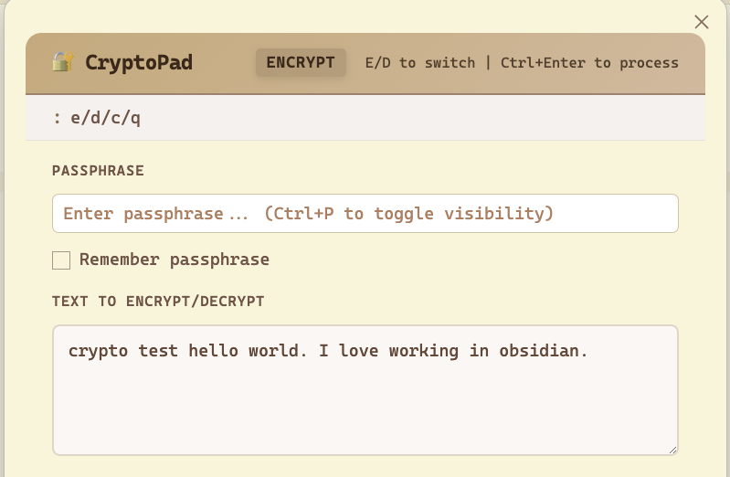

# 🔐 CryptoPad — Obsidian Plugin

Encrypt and decrypt text inline using a keyboard shortcut. Powered by AES-GCM + PBKDF2 via the Web Crypto API. Everything runs client-side — nothing is sent anywhere.



## Features

- **Keyboard shortcuts** influenced by vim to efficiently encrypt/decrypt your text
- **Encrypt & Decrypt** tabs in one modal
- Optional passphrase memory via plugin settings
- Works on **desktop and mobile**
- **AES-256-GCM** encryption with your passphrase
- **PBKDF2-SHA256** key derivation (200,000 iterations)
- Random salt + IV per encryption — every ciphertext is unique


## Installation

### From source (development)

1. Clone / copy this folder into your vault under `.obsidian/plugins/cryptopad/`
2. Run:
   ```bash
   npm install
   npm run build
   ```
3. In Obsidian: **Settings → Community Plugins → enable CryptoPad**

### Manual install (pre-built)

1. Copy `manifest.json`, `main.js`, and `styles.css` into `.obsidian/plugins/cryptopad/`
2. Reload Obsidian and enable the plugin in Community Plugins

## Usage

| Action | How |
|--------|-----|
| Open CryptoPad | `Ctrl+Shift+E` (Windows/Linux) / `Cmd+Shift+E` (Mac) |
| Encrypt | Type text → enter passphrase → click **Encrypt** |
| Decrypt | Switch to **Decrypt** tab → paste ciphertext → enter passphrase → click **Decrypt** |
| Copy result | Click **📋 Copy** |
| Quick action | `Ctrl+Enter` / `Cmd+Enter` while focused in the textarea |
| Close modal | `Escape` |

## Customizing the Shortcut

Go to **Settings → Hotkeys**, search **"CryptoPad"**, and set your preferred key combination.

## Security Notes

- Passphrase is **never transmitted** — all operations are local
- If "Remember passphrase" is enabled, it's stored via Obsidian's `saveData()` in the plugin's data file inside your vault
- Each encryption generates a fresh random **16-byte salt** and **12-byte IV**
- Output format: `base64(salt[16] || iv[12] || ciphertext)`
- AES-GCM provides both **confidentiality and integrity**

## Technical Details

| Property | Value |
|----------|-------|
| Cipher | AES-256-GCM |
| Key derivation | PBKDF2-SHA256 |
| Iterations | 200,000 |
| Salt | 16 bytes random |
| IV | 12 bytes random |
| Output encoding | Base64 |

## License

MIT
